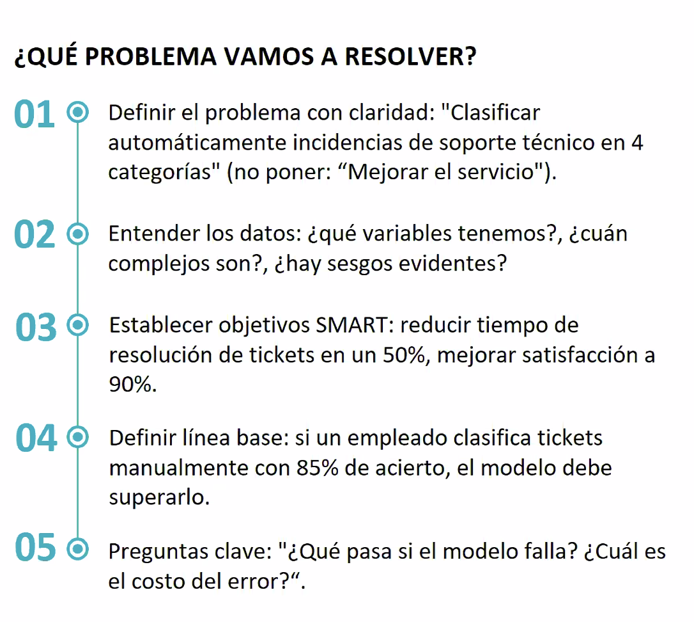

# Integración Estratégica y Ética de IA en Proyectos de Software (Clase 4)

**Curso:** Diseño de Soluciones con IA (ISIL, 2026-1)  
**Docente:** Omar David Visitación Romero  
**Fecha:** 30/04/2026

---

## 1. Introducción: No Usar IA "Por Usar"

> **Regla de oro:** Antes de implementar IA, debes evaluar si realmente es necesaria y si agrega valor.

La tecnología de IA no es una solución universal. El riesgo principal es adoptar IA sin un análisis previo del contexto empresarial y los objetivos reales.

**Conceptos clave:**
- Evaluación de **costo-beneficio**
- Análisis de **riesgos** operativos y éticos
- **Alineamiento** con objetivos corporativos
- Consideración de **normativas locales** (ej. protección de datos en Perú)

---

## 1.5. Resumen Previo: Ciclo Completo de Datos y IA

**Contexto:** Antes de poder implementar IA éticamente, es crítico entender que el **80% del tiempo** en proyectos de datos se dedica a **preparación y limpieza de datos**, mientras que solo el 20% va a análisis y modelado.

> **Principio:** No puedes construir una buena solución de IA con datos deficientes. La calidad de los datos determina la calidad del modelo.

---

## 2. Tipos de Datos: Estructura y Retos

### A. Datos Estructurados (10-15% del universo de datos)

**Definición:** Datos organizados en modelo rígido con estructura explícita y bien definida.

**Características:**
- Campos y variables claramente definidos
- Relaciones entre tablas (claves primarias y foráneas)
- Restricciones de tipo, longitud y formato
- Consultables mediante SQL
- Listos para análisis inmediato

**Ejemplos:**
- Bases de datos transaccionales (SQL)
- Hojas de cálculo con columnas definidas
- Dataset Iris (150 registros, 4 atributos numéricos)
- Registros bancarios, facturas, inventarios

**Ventaja:** Fácil de procesar y modelar directamente.

---

### B. Datos Semiestructurados (5-10%)

**Definición:** Datos con estructura conocida pero flexible, sin esquema rígido.

**Formatos:**
- JSON (JavaScript Object Notation)
- XML (eXtensible Markup Language)
- APIs REST

**Características:**
- Etiquetas y metadatos incorporados
- Flexible ante cambios
- Requiere parseo antes del análisis

**Ejemplo:**
```json
{
  "cliente": "Juan",
  "transacciones": [
    {"monto": 100, "fecha": "2026-04-30"},
    {"monto": 250, "fecha": "2026-04-29"}
  ]
}
```

---

### C. Datos No Estructurados (75-85% del universo de datos)

**Definición:** Datos sin formato predeterminado que requieren transformación significativa.

**Ejemplos Comunes:**

| Tipo | Descripción | Reto |
|---|---|---|
| **Imágenes/Video** | Fotos, videos, multimedia sin metadatos | Requiere visión por computadora |
| **Texto** | Tuits, emails, documentos, redes sociales | Interpretación variable, contexto |
| **Audio** | Podcast, grabaciones, llamadas | Requiere procesamiento de voz |
| **Redes Sociales** | Posts, comentarios, reacciones | Alto volumen, bajo valor inherente |
| **Sensores IoT** | Datos en tiempo real, streams continuos | Velocidad, volumen, ruido |

**Desafío Principal:** La mayoría de datos en el mundo son no estructurados, pero también son los más difíciles de procesar.

---

## 3. Data Wrangling: Transformación de Datos Crudos

### ¿Qué es Data Wrangling?

**Sinónimos:** Data munging, data cleaning, data preprocessing.

**Definición:** Proceso de convertir datos crudos (raw data) en un formato que sea **analizable y confiable**.

**Regla de Oro:** 
> El 80% del tiempo en proyectos de datos se dedica a preparación y limpieza de datos, mientras que solo el 20% va a análisis y modelado.

**Objetivo fundamental:**
- Garantizar que los datos sean documentados
- Asegurar que el proceso sea reproducible
- Seguir estándares internacionales de calidad (Tidy Data)

### Fases del Data Wrangling

```
Datos Crudos
    ↓
[1. Exploración y diagnóstico]
    ↓
[2. Limpieza de valores faltantes]
    ↓
[3. Detección y tratamiento de outliers]
    ↓
[4. Transformación y normalización]
    ↓
[5. Integración de fuentes]
    ↓
Datos Listos para Análisis
```

---

## 4. Tidy Data: La Norma de Oro

**Definición (Hadley Wickham, 2014):** Mapeo estándar entre significado y estructura de datos.

### Tres Principios Fundamentales

1. **Cada variable es una columna**
   - Una columna = una característica o medida
   - Ejemplo: edad, ingresos, fecha_compra

2. **Cada observación es una fila**
   - Una fila = un registro o entidad individual
   - Ejemplo: cada cliente es una fila

3. **Cada unidad observacional es una tabla**
   - Una tabla = un tipo de entidad
   - No mezclar clientes con productos en una misma tabla

**Ejemplo de Tidy Data:**

```
| cliente_id | nombre    | edad | ingreso | fecha_compra |
|------------|-----------|------|---------|--------------|
| 1          | Juan      | 35   | 5000    | 2026-04-30   |
| 2          | María     | 42   | 7500    | 2026-04-29   |
| 3          | Carlos    | 28   | 4200    | 2026-04-28   |
```

✓ Cada columna es una variable
✓ Cada fila es una observación
✓ La tabla contiene un único tipo de entidad

**Beneficio:** Define vocabulario y operadores estándar para transformación reproducible.

---

## 5. Técnicas de Limpieza y Transformación de Datos

### A. Identificación de Problemas

**Problemas Comunes:**

| Problema | Descripción | Impacto |
|---|---|---|
| **Valores faltantes (missing values)** | Campos vacíos o nulos | Sesgo en análisis |
| **Datos corruptos** | Valores inconsistentes o ilegibles | Resultados no confiables |
| **Duplicados** | Registros repetidos | Análisis inflado |
| **Outliers** | Valores atípicos extremos | Distorsión de modelos |
| **Formatos inconsistentes** | Mismo dato en diferentes formatos | Imposible comparar |

### B. Estrategias de Imputación (Valores Faltantes)

#### Método 1: Media/Mediana

**Descripción:** Reemplazar valores faltantes con la media (promedio) o mediana del conjunto.

**Ventajas:**
- Rápido y simple
- Mantiene el tamaño del dataset

**Desventajas:**
- Reduce la variabilidad real
- Puede sesgar la distribución
- Falsa precisión

**Ejemplo:**
```
Datos: [100, 150, 120, ?, 110, 140]
Media: (100+150+120+110+140)/5 = 124
Resultado: [100, 150, 120, 124, 110, 140]
```

#### Método 2: Forward Fill / Backward Fill

**Descripción:** Llenar valores faltantes propagando el último valor conocido (hacia adelante o hacia atrás).

**Adecuado para:** Series temporales (datos a lo largo del tiempo).

**Ventajas:**
- Respeta la naturaleza temporal
- Mantiene tendencias
- Simple de implementar

**Ejemplo (Forward Fill):**
```
Tiempo: [T1, T2, T3, T4, T5, T6]
Ventas: [100, 150, ?, ?, 140, 160]
Resultado: [100, 150, 150, 150, 140, 160]
(propaga T2 hacia adelante hasta T4)
```

#### Método 3: KNN / Regresión (Métodos Avanzados)

**Descripción:** Métodos sofisticados que predicen valores faltantes a partir de vecinos cercanos o relaciones estadísticas.

**KNN (K-Nearest Neighbors):**
- Busca los K registros más similares
- Usa su promedio para llenar el valor faltante

**Regresión:**
- Construye modelo basado en variables correlacionadas
- Predice el valor faltante usando el modelo

**Ventajas:**
- Más precisos y contextualmente apropiados
- Preservan relaciones entre variables
- Mejor para datos complejos

**Desventajas:**
- Computacionalmente costosos
- Requieren más datos para entrenar
- Pueden introducir sesgos del modelo

**Ejemplo (KNN con k=3):**
```
Cliente con ingresos faltantes:
- Edad: 35, Región: Norte, Educación: Universitaria

Buscar 3 clientes más similares:
- Cliente A: Edad 34, Región Norte, Educación Uni → Ingresos $5,200
- Cliente B: Edad 36, Región Norte, Educación Uni → Ingresos $5,400
- Cliente C: Edad 35, Región Norte, Educación Uni → Ingresos $5,300

Promedio: ($5,200 + $5,400 + $5,300) / 3 = $5,300
Ingreso imputado: $5,300
```

---

### C. Detección de Outliers

**Definición:** Valores extremos que se desvían significativamente del patrón normal.

**Importancia:** Los outliers pueden ser:
- Errores de medición → Eliminar
- Eventos genuinos → Investigar
- Fraudes → Alertar

**Métodos:**
1. **Rango Intercuartílico (IQR):** Valores fuera de Q1±1.5×IQR
2. **Z-Score:** Valores con |Z| > 3
3. **Desviación absoluta mediana (MAD):** Para datos no normales

---

### D. Transformación y Normalización

**Objetivo:** Escalar y transformar variables para que sean comparables.

**Técnicas Comunes:**

| Técnica | Fórmula | Uso |
|---|---|---|
| **Normalización (0-1)** | $(x - \min) / (\max - \min)$ | Datos con rango conocido |
| **Estandarización (Z-score)** | $(x - \mu) / \sigma$ | Comparar variables diferentes |
| **Log Transform** | $\log(x)$ | Datos sesgados positivamente |
| **Raíz cuadrada** | $\sqrt{x}$ | Reducir outliers moderados |

**Ejemplo:**
```
Ventas (rango $0-$1,000,000):
Estandarizado: (x - 500,000) / 250,000
Nuevo rango: -2 a +2 (desviaciones estándar)
```

---

## 6. Fuentes de Datos: Dónde Vienen los Datos

### Principales Orígenes

| Fuente | Descripción | Volumen | Calidad |
|---|---|---|---|
| **Transacciones** | E-commerce, bancos, retail | Alto | Buena |
| **Redes Sociales** | X, Facebook, TikTok, LinkedIn | Muy Alto | Variable |
| **Instituciones** | Gobiernos, universidades, hospitales | Alto | Buena (regulada) |
| **Sensores IoT** | Smart cities, industria 4.0, wearables | Masivo | Media (ruido) |
| **Open Data** | Kaggle, Google Dataset, datos públicos | Variable | Variable |

---

## 7. Análisis Exploratorio de Datos (EDA)

**Regla de oro:** Antes de modelar, explora los datos para entender patrones, distribuciones y anomalías.

> **Dato importante:** El 80% del tiempo en ciencia de datos se dedica a exploración, limpieza y preparación. Solo el 20% va a análisis y modelado.

### A. Herramientas: Python vs. Excel

| Herramienta | Caso de Uso | Ventaja | Limitación |
|---|---|---|---|
| **Excel** | Exploración rápida de datasets pequeños | Visualización inmediata, fácil de aprender | Máximo ~100,000 filas, no escalable |
| **Python (Pandas)** | Análisis profesional y reproducible | Scalable, automatizable, documentable | Requiere programación |

**Regla práctica:** Excel para prototipado, Python para producción.

### B. Estadística Descriptiva: Entender los Datos

**Conceptos Clave:**

1. **Media (Mean):** Promedio aritmético
   - Ventaja: Fácil de calcular
   - Desventaja: Sensible a outliers
   - Ejemplo: Salarios [3000, 3500, 4000, **100000**] → Media = 27,625 (inflada)

2. **Mediana (Median):** Valor central de la distribución
   - Ventaja: Robusta frente a outliers
   - Desventaja: Menos eficiente con datos normales
   - Mismo ejemplo: Mediana = 3,750 (más representativo)

3. **Desviación Estándar (σ):** Mide dispersión alrededor de la media
   - σ pequeña: datos cercanos a la media
   - σ grande: datos dispersos
   - Interpretación: 68% de datos están entre media ± σ

4. **Cuartiles (Q1, Q2, Q3):** Dividen datos en 4 partes iguales
   - Q1 (25%): El 25% de datos está por debajo
   - Q2 (50%): La mediana
   - Q3 (75%): El 75% de datos está por debajo
   - IQR (Rango intercuartílico) = Q3 - Q1

**Visualización Conceptual:**

```
Distribución Normal (Gaussiana)

                    68%
                  ← → ← →
             μ-σ   μ   μ+σ
              |     |    |
         _____|_____|____|_____
        /               \
    ___/                 \___
              ↓
        68% de datos dentro de 1σ
        95% de datos dentro de 2σ
        99.7% de datos dentro de 3σ
```

### C. Análisis de Distribuciones

**Tipos de distribuciones:**

| Distribución | Característica | Indicador |
|---|---|---|
| **Gaussiana (Normal)** | Simétrica alrededor de la media | Media ≈ Mediana, forma acampanada |
| **Sesgada Positiva** | Cola larga a la derecha | Media > Mediana (inflada por valores altos) |
| **Sesgada Negativa** | Cola larga a la izquierda | Media < Mediana (deprimida por valores bajos) |
| **Uniforme** | Todos los valores igual de probables | Distribución plana |
| **Exponencial** | Decaimiento rápido | Modela tiempos entre eventos |

**Ejemplo Real - Distribución de Ingresos:**

```
Sesgada Positiva (cola derecha):

Frecuencia
    |      ▁▂▃▄▆█▆▄▂
    |   ▁▃▅▇▆▄▂     ▁▂ ← Multimillonarios
    |▃▅▇          ▂▅  ▁
    |_______________|___|___
    0           Ingreso medio  Muy altos

Conclusión: Mayoría gana menos que la media 
(porque pocos superricos inflan el promedio)
```

### D. Análisis de Correlaciones

**Correlación de Pearson (r):** Mide relación lineal entre dos variables.

**Rango:** r ∈ [-1, 1]

| Valor | Significado | Ejemplo |
|---|---|---|
| r = 1.0 | Correlación perfecta positiva | Más edad → más experiencia laboral |
| r = 0.7 | Fuerte correlación positiva | Más estudio → más ingresos |
| r = 0 | Sin correlación lineal | Número de zapato ↔ Inteligencia |
| r = -0.7 | Fuerte correlación negativa | Más ejercicio → menos peso |
| r = -1.0 | Correlación perfecta negativa | Velocidad ↑ → Tiempo ↓ |

**Interpretación Visual:**

```
r = 0.9 (Fuerte positiva)    r = 0 (Sin relación)      r = -0.8 (Fuerte negativa)

    Y ▁                           Y ▁                       Y ▁
      │   ●                         │  ●   ●                  │              ●
      │      ●                      │    ●    ●               │           ●
      │        ●                    │  ●      ●               │        ●
      │          ●                  │    ●  ●  ●             │     ●
      │           ●                 │  ●  ●  ●               │  ●
      └──────────X                  └─────────X              └─────────X
        "A medida que X aumenta,      "No hay patrón        "A medida que X aumenta,
         Y también aumenta"            evidente"             Y disminuye"
```

**Caso Práctico - E-commerce:**

```
Correlación entre:
- Tiempo en el sitio vs. Monto de compra: r = 0.65 ✓
  → Usuarios que pasan más tiempo compran más

- Número de reseñas leídas vs. Satisfacción: r = 0.82 ✓
  → Leer reseñas reduce compras impulsivas

- Descuento ofrecido vs. Devoluciones: r = 0.45 ✓
  → Descuentos muy altos generan más devoluciones
```

### E. Visualización de Datos: El Poder de las Gráficas

> Un gráfico revela lo que 1,000 números ocultan.

**Gráficos Univariables (Una variable):**

| Gráfico | Uso | Detección |
|---|---|---|
| **Histograma** | Distribuir en intervalos (bins) | Forma de distribución, moda |
| **Densidad** | Curva suave aproximando distribución | Identificar gaussiana vs. sesgada |
| **Box Plot** | Mediana, cuartiles, outliers | Q1, Q2, Q3, y valores atípicos gráficamente |

**Gráficos Multivariables (Múltiples variables):**

| Gráfico | Uso |
|---|---|
| **Scatter Plot (Dispersión)** | Relación entre dos variables (X vs Y) |
| **Heatmap (Matriz de correlación)** | Visualizar correlaciones entre todos los pares de variables |
| **Pairplot** | Matriz de gráficos de dispersión para todas las combinaciones |

**Ejemplo Visual - Box Plot (Detección de Outliers):**

```
                ●  ← Outlier (valor atípico)
          ────┐ │
          │   │ │   Rango: Q1 - 1.5×IQR a Q3 + 1.5×IQR
       Q1─┤   │ │   (valores fuera son outliers)
          │   │ │
       Q2─┼───┼─┤   Mediana (Q2)
          │   │ │
       Q3─┤   │ │
          └───┘ │
          ────┘ 
        
        IQR = Q3 - Q1
```

### F. Herramientas Python para EDA

**Stack de Datos Essencial:**

```python
import pandas as pd         # Manipulación de datos
import numpy as np          # Computación numérica
import matplotlib.pyplot    # Gráficos básicos
import seaborn             # Gráficos avanzados
from sklearn.preprocessing # Normalización, transformación
```

**Código Básico:**

```python
# Cargar datos
data = pd.read_csv('datos.csv')

# Exploración inicial
print(data.shape)              # Dimensiones (filas, columnas)
print(data.describe())         # Estadísticas: media, std, min, max
print(data.isnull().sum())     # Valores faltantes

# Correlaciones
corr_matrix = data.corr()      # Matriz de correlaciones
print(corr_matrix)

# Visualización
import matplotlib.pyplot as plt
plt.hist(data['variable'], bins=20)  # Histograma
plt.boxplot(data['variable'])        # Box plot
plt.scatter(data['x'], data['y'])    # Scatter plot
plt.show()
```

### G. Checklist - Análisis Exploratorio Completo

- [ ] **Dimensiones:** ¿Cuántas filas y columnas?
- [ ] **Resumen estadístico:** Media, mediana, desviación estándar
- [ ] **Valores faltantes:** ¿Dónde y cuántos?
- [ ] **Distribuciones:** ¿Gaussiana, sesgada, uniforme?
- [ ] **Outliers:** ¿Hay valores atípicos? ¿Son errores o información valiosa?
- [ ] **Correlaciones:** ¿Qué variables se relacionan entre sí?
- [ ] **Visualización:** ¿Los gráficos revelan patrones?
- [ ] **Calidad:** ¿Los datos son confiables para modelado?

---

## 8. Selección del Modelo y Valor Empresarial

### ¿Cuándo la IA Añade Valor?

Identifica procesos con estas características:

| Característica | Indicador | Ejemplo |
|---|---|---|
| **Deficiencia manual** | Procesos lentos o propensos a errores humanos | Auditoría manual de miles de documentos |
| **Volumen alto** | Datos o transacciones que no pueden ser revisados totalmente | 10,000 audios de reclamos diarios |
| **Patrón repetitivo** | Tarea estructurada con reglas consistentes | Clasificación de tickets de soporte |
| **Impacto medible** | Mejora cuantificable: tiempo, costo, precisión | Reducir error del 5% al 1% |

### Evaluación Previa

**Preguntas clave antes de implementar:**

1. ¿Qué problema específico resuelve esta IA?
2. ¿Cuánto tiempo/costo ahorra comparado con el método manual?
3. ¿Qué datos sensibles se requieren? ¿Cumplen con normativas?
4. ¿Quién supervisa las decisiones que toma la IA?
5. ¿Qué ocurre si el modelo falla?

### Caso Práctico: Sector Telecomunicaciones

**Situación:**
- Reciben miles de audios con reclamos diarios
- Un humano NO puede escucharlos todos
- Necesidad: verificar si la empresa cumple plazos de respuesta y si registra correctamente los reclamos

**Solución IA:**
- Modelo de procesamiento de audio que clasifica automáticamente reclamos
- Identifica palabras clave (servicio deficiente, reembolso, etc.)
- Valida que se registren en el sistema dentro del SLA

**Valor agregado:**
- ✓ Análisis 100% de audios en tiempo real
- ✓ Identificación inmediata de reclamos críticos
- ✓ Cumplimiento normativo verificable
- ✓ Reducción de carga manual

---

## 9. Modelos Propios vs. Modelos de Mercado (LLM)

### Dilema Central: Construir vs. Consumir

| Aspecto | Modelos Top (GPT, Claude, etc.) | Modelos Propios |
|---|---|---|
| **Precisión** | Muy alta, entrenados con billones de tokens | Variable, depende de datos de calidad |
| **Capacidad de cómputo** | Inmensa (miles de GPUs) | Limitada, requiere inversión |
| **Privacidad de datos** | Riesgo: datos sensibles se envían vía API | Control total, datos internos |
| **Confidencialidad** | Preocupación: ¿se guardan nuestros datos? | Garantizada si está en infraestructura propia |
| **Costo inicial** | Bajo (acceso por API) | Alto (infraestructura + científicos de datos) |
| **Mantenimiento** | Proveedor actualiza | Responsabilidad propia |

### Riesgos Principales

**Con modelos de mercado:**
- Enviar DNI, teléfonos o datos médicos a servidores de terceros
- Confidencialidad comprometida en sectores regulados (banca, salud)
- Dependencia de proveedor externo

**Con modelos propios:**
- Difícil competir en precisión con gigantes tecnológicos
- Inversión alta en talento especializado
- Requiere volumen suficiente de datos de calidad

### Recomendación Práctica

**Usa modelos de mercado para:**
- Tareas de lenguaje general
- Prototipado rápido
- Baja sensibilidad de datos

**Desarrolla modelos propios para:**
- Datos altamente confidenciales (finanzas, salud)
- Casos de uso muy específicos del negocio
- Cuando el volumen justifica la inversión

---

## 10. Fases del Desarrollo de un Modelo de IA

### Flujo de Tres Etapas

```
1. Selección del Modelo
          ↓
2. Entrenamiento (con datos)
          ↓
3. Afinamiento (Tuning) & Optimización
```

### Fase 1: Selección del Modelo

**Decisión:** ¿Qué tipo de problema resuelve?

| Tipo | Problema | Ejemplo |
|---|---|---|
| **Regresión** | Predecir valor numérico continuo | Estimar ventas futuras |
| **Clasificación** | Asignar a categorías discretas | ¿Este email es spam? (sí/no) |
| **Clustering** | Agrupar datos sin etiquetas | Segmentar clientes por comportamiento |
| **NLP** | Procesar texto/audio | Análisis de sentimiento, transcripción |
| **Visión** | Analizar imágenes/video | Detección de objetos, OCR |

### Fase 2: Entrenamiento

**Principio fundamental:** A mayor volumen de datos de CALIDAD, mejor desempeño.

**Datos requeridos:**
- **Cantidad:** Mínimo 100-1,000+ ejemplos etiquetados (depende de complejidad)
- **Calidad:** Limpios, sin inconsistencias o valores faltantes
- **Diversidad:** Representativos de casos reales variados

**Ejemplo:**
- Para clasificar emails como spam: necesitas 5,000+ emails etiquetados como "spam" y "legítimo"
- Si solo tienes 100 ejemplos, el modelo será impreciso

### Fase 3: Afinamiento (Tuning)

**Objetivo:** Optimizar parámetros para mejorar precisión una vez evaluado.

**Pasos típicos:**
1. Dividir datos: 70% entrenamiento, 15% validación, 15% prueba
2. Entrenar modelo con parámetros iniciales
3. Evaluar en conjunto de validación
4. Ajustar hiperparámetros (tasa de aprendizaje, regularización, etc.)
5. Probar en conjunto de prueba (datos nunca vistos)
6. Si error es alto → volver a fase 2 o 3

---

## 11. Técnicas de Modelamiento y Procesamiento

### A. Regresión Lineal

**Qué es:** Modelo que predice un valor continuo basado en una relación lineal con variables independientes.

**Fórmula básica:**
$$\hat{y} = a + b \cdot x$$

**Cuándo usarla:**
- Predicciones numéricas
- Cuando existe relación lineal observable

**Ejemplo: Proyección de Compras en E-commerce**

```
Eje X: Mes (1, 2, 3, 4, 5...)
Eje Y: Número de compras (150, 180, 210, 240, 270...)

Tendencia lineal: Y = 100 + (30 × X)
Predicción mes 6: 100 + (30 × 6) = 280 compras estimadas
```

**Aplicación real:**
- Estimar ingresos por trimestre
- Proyectar demanda de producto
- Previsión de churn de usuarios

### B. Clasificación / Clusterización

**Clasificación:** Asignar datos a categorías predefinidas.

**Clusterización:** Agrupar datos por similitud SIN etiquetas previas.

**Ejemplo de Clasificación: Segmentación de Consumidores para Marketing**

```
Datos de entrada: Edad, ingresos, histórico de compras
Categorías de salida: Grupo 1 (18-25 años, estudiantes)
                      Grupo 2 (40-50 años, profesionales)
                      Grupo 3 (60+ años, jubilados)

Decisión de marketing: 
- Grupo 1 → Redes sociales, ofertas en apps móviles
- Grupo 2 → Email marketing, promociones corporativas
- Grupo 3 → TV, correo postal
```

**Beneficios:**
- Campañas personalizadas por grupo
- Mayor tasa de conversión
- Mejor ROI en publicidad

---

### C. Vectorización

**Qué es:** Representación matemática de palabras/conceptos como vectores (puntos en un espacio multidimensional).

**Concepto fundamental:**

Cada palabra se representa con un vector de números (ej. 300 dimensiones en modelos modernos). Palabras con significado similar tienen vectores cercanos en el espacio.

**Ejemplo Visual:**

```
En un espacio 2D simplificado:

                  Eje Y (Sentimiento positivo)
                       ↑
        "excelente"    |     "buena"
               *       |       *
               |       |       |
    "persona"--*-------+-------*-- "feliz"
               |       |       |
               *       |       *
        "malo" |    "neutro"
               ↓
         Eje X (Polaridad)

Palabras cercanas: "buena" y "feliz" (ambas positivas)
Palabras lejanas: "malo" y "excelente" (polaridades opuestas)
```

**Aplicación en NLP:**
- El modelo entiende que "buena" y "persona" son semánticamente relacionadas
- "avión" está en una dirección completamente distinta (contexto diferente)
- Permite encontrar sinónimos, relaciones y patrones sin reglas explícitas

**Caso de uso: Recomendaciones**
```
Si un usuario vio "producto A" (vector cercano a deportes),
el sistema recomienda productos con vectores similares
(otros artículos deportivos)
```

---

## 12. Metodología Design Thinking para IA

### Estructura del Proceso

Design Thinking es un framework centrado en el usuario para resolver problemas complejos con IA.

```
EMPATÍA → DEFINICIÓN → IDEACIÓN → PROTOTIPADO → TESTING
  ↓          ↓            ↓          ↓             ↓
Entender  Establecer   Elegir      MVP        Validar &
el        metas con    tecnología  (Mínimo    Iterar
problema  datos                    Viable)
```

### Fase 1: Empatía

**Objetivo:** Entender por qué ocurre el problema desde la perspectiva del usuario.

**Actividades:**
- Entrevistar operarios y usuarios finales
- Observar cómo trabajan actualmente
- Identificar puntos de dolor (pain points)

**Ejemplo en Telecomunicaciones:**
```
Pregunta: ¿Por qué los reclamos se atienden lentamente?

Descubrimiento:
- El equipo de análisis no tiene tiempo de revisar todos los audios
- No hay priorización automática de reclamos críticos
- El proceso es manual y propenso a errores
```

### Fase 2: Definición

**Objetivo:** Establecer metas claras y cuantificables.

**Requisitos:**
- Metas con datos (no subjetivas)
- Métricas de éxito específicas
- Línea base actual para comparación

**Ejemplo:**
```
Meta inicial: "Procesar más reclamos"
Meta definida: "Reducir error en clasificación de reclamos 
               del 5% al 1% en 3 meses"

Métrica: Precisión (accuracy) del modelo
Línea base: 95% (5% de error)
Objetivo: 99% (1% de error)
```

### Fase 3: Ideación

**Objetivo:** Seleccionar la tecnología que mejor se adapte.

**Opciones evaluadas:**
- Reglas manuales (propenso a errores)
- Modelos tradicionales (ML clásico)
- Deep learning (redes neuronales)
- LLM genéricos (GPT, Claude)

**Decisión en el ejemplo:**
→ Modelo de clasificación con NLP + audio processing
(balance entre precisión, velocidad y costo)

### Fase 4: Prototipado

**Objetivo:** Crear un MVP (Producto Mínimo Viable) antes de escalar.

> **MVP:** La versión más simple que demuestra que la idea funciona.

**Regla clave:** NO proceses 10,000 audios inicialmente.

**Ejemplo:**
```
Paso 1: Procesar y clasificar 10 audios manualmente
Paso 2: Entrenar modelo con esos 10 ejemplos
Paso 3: Probar en 5 audios nuevos
Paso 4: Medir precisión (¿clasificó correctamente?)
Paso 5: Si funciona, aumentar a 100 audios
Paso 6: Si sigue funcionando, escalar a 1,000
```

**Ventajas del MVP:**
- Identifica problemas tempranamente
- Reduce costo de fallos
- Genera feedback rápido del usuario
- Permite iteración ágil

### Fase 5: Testing y Validación

**Métricas a evaluar:**

| Métrica | Definición | Umbral Aceptable |
|---|---|---|
| **Precisión (Accuracy)** | % de clasificaciones correctas | >95% |
| **Latencia** | Tiempo de respuesta por audio | <5 segundos |
| **Recall** | % de casos positivos detectados | >90% |
| **F1-Score** | Balance entre precisión y recall | >0.93 |

**Si error es alto o latencia supera umbral:**
- → **Rollback:** vuelves a fase 3 o 2
- Ajusta modelo, parámetros o datos
- Vuelves a entrenar y testear

**Ejemplo de decisión:**
```
Resultado MVP:
- Accuracy: 88% (por debajo del 95% requerido)
- Latencia: 3 segundos (aceptable)

Decisión: Rollback
- Agregar más datos de entrenamiento
- Aumentar complejidad del modelo
- Re-entrenar y re-testear
```

---

## 13. Ética, Transparencia y Sesgos

### Responsabilidad del Desarrollador

> **Principio fundamental:** El desarrollador es responsable no solo de lo que la IA hace, sino de CÓMO y PARA QUÉ lo hace.

### A. Transparencia

**Qué significa:**
- Documentar cómo se entrenó el modelo
- Explicar qué datos se usaron
- Revelar limitaciones y sesgos conocidos
- Comunicar cómo se toman las decisiones

**Ejemplo:**
```
❌ Incorrecto: "La IA decidió rechazar el crédito"
✓ Correcto: "El modelo clasificó este solicitud como 
           riesgo alto basado en: deuda actual (80%), 
           historial de pagos (15%), ingresos (5%).
           Si cree que esta decisión es injusta, 
           puede apelar a [contacto]"
```

### B. Sesgo (Bias)

**Qué es:** Cuando el modelo toma decisiones injustas o discriminatorias porque fue entrenado con datos incompletos o dirigidos.

**Ejemplo Clásico: Elección del "Mejor Futbolista"**

```
Datos de entrenamiento: Solo jugadores europeos

Resultado: El modelo SOLO aprende características 
europeas (estatura, estilo de juego, contexto)

Sesgo: Ignora talento de jugadores africanos, sudamericanos
o asiáticos porque NO están representados en los datos

Decisión sesgada: "Los mejores futbolistas son europeos"
                  (conclusión falsa, datos sesgados)
```

**Consecuencias del sesgo:**
- Discriminación en contratación, créditos, justicia
- Pérdida de reputación empresarial
- Riesgos legales y regulatorios

### C. Cómo Evitar Sesgos

| Paso | Acción |
|---|---|
| 1 | Audit de datos: ¿Están representados todos los grupos? |
| 2 | Balancear clases: Asegurar proporción de muestras |
| 3 | Pruebas de equidad: Evaluar precisión por grupo demográfico |
| 4 | Revisión externa: Auditores independientes verifican |
| 5 | Monitoreo continuo: Detectar sesgos después del despliegue |

**Ejemplo práctico:**
```
Modelo de aprobación de crédito

Datos: 1,000 solicitudes
- 800 hombres → 700 aprobados (87.5%)
- 200 mujeres → 140 aprobados (70%)

Sesgo detectado: Tasa de aprobación desigual por género

Acción: Re-entrenar con balanceo, agregar variables 
de control, auditar de nuevo
```

### D. Supervisión Humana (Regulación)

**Sentencia de Colombia (Caso Real):**

> La IA puede **apoyar** a la justicia, pero la **decisión final siempre debe ser de un humano**, especialmente en temas de derechos fundamentales.

**Aplicación práctica:**

| Contexto | Rol de IA | Rol del Humano |
|---|---|---|
| **Medicina** | Detecta tumores en radiografía | Médico diagnostica y prescribe |
| **Justicia** | Predice riesgo de reincidencia | Juez toma decisión final |
| **Crédito** | Clasifica riesgo inicial | Ejecutivo revisa y aprueba/rechaza |
| **RRHH** | Filtra candidatos | Gerente entrevista y contrata |

**Regla de oro:**
```
❌ "La IA decidió automáticamente"
✓ "La IA recomendó, el experto decidió"
```

---

## 14. Resumen: Checklist para Implementar IA Responsable

Antes de desplegar cualquier solución de IA, verifica:

- [ ] **Análisis de contexto:** ¿Resuelve un problema real con valor medible?
- [ ] **Decisión modelo:** ¿Es propio o de mercado? ¿Se justifica el costo?
- [ ] **Datos:** ¿Tenemos volumen y calidad suficiente?
- [ ] **Design Thinking:** ¿Pasamos por empatía, definición e ideación?
- [ ] **MVP:** ¿Prototipamos antes de escalar?
- [ ] **Métricas:** ¿Definimos precisión, latencia y otras métricas?
- [ ] **Testing:** ¿Evaluamos exhaustivamente antes de producción?
- [ ] **Transparencia:** ¿Documentamos cómo funciona?
- [ ] **Sesgos:** ¿Auditamos el modelo para bias?
- [ ] **Supervisión humana:** ¿Un experto revisa decisiones críticas?
- [ ] **Cumplimiento legal:** ¿Respetamos normativas locales (privacidad, datos)?

---

## 15. Próximas Actividades

1. **Lectura profunda:** Revisar las láminas del PPT `40098-S04-PRESENTACION.pptx`
2. **Investigación:** Subir investigación de modelos de IA a la plataforma (contenedores se habilitarán pronto)
3. **Caso práctico:** Resolver nuevo caso basado en contenidos de esta clase

---

## 16. Referencia Visual



*Fuente: Presentación clase 4 — Materiales del curso*

---

## 17. Recursos Complementarios

- 📊 **Presentación (PDF):** [40098-S04-PRESENTACION.pdf](./40098-S04-PRESENTACION.pdf)
- 📑 **Presentación original (PPTX):** 40098-S04-PRESENTACION.pptx

---

*Última actualización: 30/04/2026 | Clase 4: Integración Estratégica y Ética de IA*
