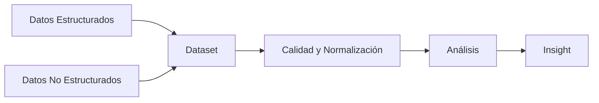

# Datasets, Insights y Storytelling (Clase 7)

**Curso:** Diseño de Soluciones con IA (ISIL, 2026-1)  
**Docente:** Omar David Visitación Romero  
**Fecha:** [pendiente]

---

## 1. De la Analítica de Datos (Analytics) al Insight

El verdadero valor para una empresa aparece cuando la analítica se transforma en un insight.

- **Analítica de Datos (El "Qué"):** describe lo que pasó o predice lo que podría pasar.
  - Ejemplo: "Las ventas subieron un 10%."
- **Insight (El "Por qué" + Acción):** es la conclusión útil que genera valor y permite una acción concreta.
  - Ejemplo: "Las ventas subieron un 10% porque se aplicó la promoción con el código X; por lo tanto, debemos replicar esa campaña."

### Pasos para obtener un insight

1. **Formular dudas clave:** preguntas de negocio como "¿Qué cliente respondería mejor?".
2. **Análisis exploratorio:** resumir datos e identificar anomalías.
3. **Modelado:** aplicar estadística o machine learning (por ejemplo, clustering para segmentar perfiles).
4. **Interpretación de resultados:** entender qué dicen los modelos.
5. **Confirmación/validación:** verificar que el análisis es correcto antes de actuar.

---

## 2. Origen y Estructura de los Datos (Datasets)

Para hacer analítica, los datos deben estar organizados en un repositorio.

### Tipos de datos

- **Estructurados:** filas y columnas definidas, como tablas de bases de datos relacionales. Son los más cómodos para trabajar.
- **No estructurados:** archivos sin formato fijo, como PDFs, PPTs, audios, videos e imágenes.

### Qué es un dataset

Es el conjunto de datos con sus atributos que definen una entidad.

**Ejemplo de buena práctica:**

- Una tabla de clientes debe incluir un **ID numérico consecutivo (1, 2, 3...)**.
- Esto permite auditorías y detectar registros eliminados o modificados.
- Además debe incluir atributos como `edad`, `ubicación`, `historial`, `teléfono`, etc.

### Fuentes de datos

- **Internos:** ERP, CRM, bases de datos de operaciones internas y la interacción directa con clientes.
- **Externos:** redes sociales, logs de clics y sesiones web, open data y estudios de mercado.

### Control de calidad y normalización

Antes de aplicar cualquier modelo es obligatorio limpiar la data para evitar sesgos.

- Ejemplo: si existen valores como "Perú", "peru" y "PERÚ", el sistema los tratará como tres registros distintos.
- La limpieza consiste en estandarizar a un único formato, por ejemplo: "PERÚ".

---

## 3. Métricas, KPIs y Modelos de Evaluación

Lo que no se mide, no se puede mejorar.

### Tipos de métricas

- **Regresión:** predice valores numéricos continuos.
  - Ejemplos: Error Cuadrático Medio, R-cuadrado.
- **Clasificación:** evalúa la precisión de categorías.
  - Utiliza la matriz de confusión:
    - Verdaderos Positivos
    - Verdaderos Negativos
    - Falsos Positivos
    - Falsos Negativos
  - Idealmente, los errores deben sumar menos del 5%.

### Métricas de negocio vs. métricas de modelo

- **Métrica de modelo:** mide la performance del algoritmo.
  - Ejemplo: costo estimado de adquisición de cliente según una fórmula matemática.
- **Métrica de negocio:** mide el impacto real en el negocio.
  - Ejemplo: "Invertimos 1,000 y ganamos 1,500; la rentabilidad es 500."

### Por qué importa

- Permite hacer benchmarking.
- Facilita comparar campañas y modelos.
- Conecta resultados técnicos con objetivos comerciales.

---

## 4. Storytelling: Contar Historias con Datos

Los tomadores de decisiones son ejecutivos que no siempre entienden código. El storytelling hace que la información sea accesible y accionable.

### Elementos clave

- **Personajes:** clientes o segmentos estudiados.
- **Trama y desafío:** el problema que se intenta resolver.
- **Evidencia visual:** gráficos limpios y precisos.
- **Cierre con impacto:** una recomendación clara.

### Buenas prácticas

- **Simplificación:** muestra solo lo más relevante.
- **Evitar jerga:** usa un lenguaje claro y profesional.
- **Cierre con acción:** termina con una recomendación directa.

**Ejemplo:**

- Mal: "La correlación entre edad e ingresos es 0.65."
- Bien: "Los clientes de 25-35 años son 2x más propensos a comprar el producto entry-level. Si enfocamos marketing digital en este grupo, proyectamos un 15% más de conversión."

---

## 5. Aplicaciones y casos prácticos

### Redes sociales

- Dato: alcance, impresiones, interacciones.
- Insight: qué contenido genera más engagement y cuándo publicar.

### E-commerce

- Dato: historial de transacciones, importes, fechas.
- Insight: patrones estacionales y lifetime value promedio.

### Campañas de marketing

- Dato: segmentos y resultados de pruebas A/B.
- Insight: qué mensaje logra mayor tasa de apertura y clics.

---

## 6. Conclusiones y recomendaciones

- El valor real no está en la analítica, sino en el insight.
- Los datasets deben estar bien estructurados y normalizados.
- Las métricas deben conectar el modelo con el negocio.
- El storytelling transforma datos técnicos en decisiones estratégicas.

---

## Archivo generado

- `2026-1/diseno-soluciones-ia/clase-7/40098-S07-PRESENTACION.pdf`
