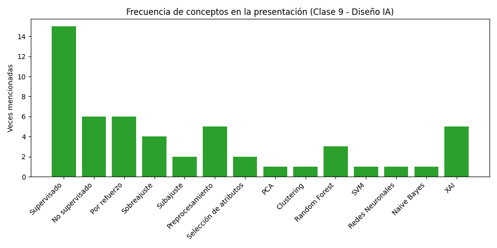
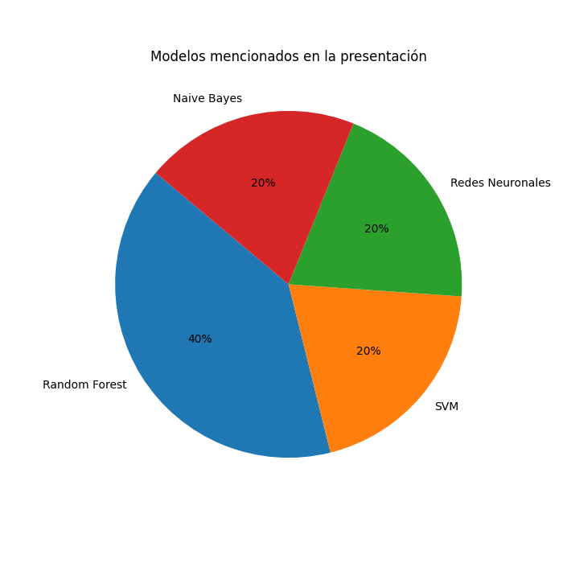

# Resumen detallado — Clase 9: Herramientas y modelado (Diseño de soluciones IA)

## Resumen ejecutivo
Esta clase cubre de forma completa los conceptos que intervienen en el diseño de soluciones basadas en IA: tipos de aprendizaje, el proceso de entrenamiento, calidad de datos, elección de algoritmos, evaluación de resultados, predicción e interpretabilidad. El objetivo es comprender cómo pasar de datos a una solución inteligente confiable.

## Objetivos de la sesión
- Entender qué son los modelos IA y por qué automatizan decisiones.
- Conocer los tipos de aprendizaje: supervisado, no supervisado y por refuerzo.
- Describir el ciclo de un proyecto de machine learning: datos, modelado, validación y producción.
- Identificar pasos clave en el preprocesamiento, selección de atributos y elección de modelos.
- Aprender métricas de evaluación, técnicas de validación y cómo evitar sobreajuste.
- Introducir la interpretación de resultados y el papel de la IA explicable (XAI).

## Introducción: modelos IA como puente entre datos y soluciones
- Los modelos de IA permiten automatizar decisiones y generar predicciones a partir de datos.
- El desarrollo de modelos es el puente entre el análisis de datos y la solución inteligente.
- Comprender cómo funcionan los modelos es clave antes de implementarlos en el negocio.
- Esta sesión mezcla teoría con aplicación práctica, usando herramientas como Google Colab, Python y librerías de IA.

## Tipos de aprendizaje de modelos IA
### Aprendizaje supervisado
- Se entrena con datos etiquetados.
- El modelo aprende una función que mapea entradas a salidas correctas.
- Clasificación: asignar categorías (por ejemplo, detectar spam o diagnóstico médico).
- Regresión: predecir valores numéricos (por ejemplo, precio de una vivienda).
- Útil cuando se dispone de datos históricos con respuestas conocidas.

### Aprendizaje no supervisado
- Trabaja con datos sin etiquetas.
- El modelo busca estructuras ocultas: agrupaciones y resúmenes.
- Clustering: agrupar clientes similares para segmentación de mercado.
- Reducción de dimensión: simplificar variables complejas con técnicas como PCA.

### Aprendizaje por refuerzo
- Un agente aprende mediante prueba y error en un entorno.
- No utiliza datos etiquetados; recibe recompensas o castigos.
- Busca maximizar la recompensa a largo plazo.
- Ejemplo práctico: aterrizaje de drones o robots que mejoran su estrategia con experiencia.

### Más allá de lo básico
- Aprendizaje semisupervisado: combinar muchos datos no etiquetados con pocos etiquetados.
- Aprendizaje por transferencia: reutilizar un modelo ya entrenado para una tarea nueva relacionada.
- Aprendizaje autosupervisado: el modelo genera sus propias etiquetas a partir de los datos.

## Ciclo de un proyecto de machine learning
### Fase 1: datos y preparación
- Definir métricas y establecer una línea base.
- Recolección de datos, limpieza y análisis exploratorio.
- Detectar outliers, datos nulos y problemas de calidad.

### Fase 2: modelado
- Dividir los datos en entreno y prueba.
- Elegir algoritmo y ajustar parámetros.
- Entrenamiento iterativo con validación constante.

### Fase 3: producción
- Despliegue del mejor modelo en el sistema real.
- Mantenimiento y monitoreo del desempeño frente a nuevos datos.

## Preprocesamiento de datos
- “Garbage in, garbage out”: la calidad del modelo depende de los datos.
- Higiene: limpiar valores nulos, corregir errores y eliminar outliers.
- Formato: convertir texto a números, codificar variables y normalizar escalas.
- Equilibrio: balancear clases desproporcionadas para evitar sesgos.
- Un buen preprocesamiento mejora la eficiencia y la precisión del modelo.

## Selección de atributos
- Empezar con todas las variables crudas y eliminar las irrelevantes.
- Filtrar redundancias y transformar variables cuando sea necesario.
- El objetivo es obtener un set de características relevantes que haga al modelo más rápido y preciso.
- Las técnicas pueden incluir filtros estadísticos y reducción de dimensionalidad.

## Elección de modelos y algoritmos
### Árbol de decisión
- Es interpretable y fácil de explicar: cada nodo representa una decisión basada en una característica.
- Ideal para datos categóricos o mixtos y para casos donde el equipo necesita justificar decisiones.
- No requiere mucha preparación de datos, pero puede sobreajustar si el árbol es muy profundo.

### Random Forest
- Agrupa muchos árboles de decisión y combina sus predicciones mediante votación o promedio.
- Reduce el sobreajuste de árboles individuales y mejora la precisión general.
- Es una buena primera opción cuando se necesita un modelo robusto y estable.
- Hiperparámetros clave: número de árboles (`n_estimators`), profundidad máxima (`max_depth`) y número de variables por división (`max_features`).

### SVM (Support Vector Machine)
- Busca la frontera que mejor separa clases en el espacio de características.
- Es útil cuando las clases no se separan linealmente, usando kernels como RBF o polinómico.
- Funciona bien con datasets de tamaño medio y en problemas con muchas dimensiones.
- Requiere normalizar los datos y seleccionar correctamente el parámetro de regularización (`C`).

### Redes Neuronales
- Capturan relaciones altamente no lineales y patrones complejos en datos grandes.
- Pueden incluir capas ocultas, activaciones, regularización y optimización por descenso de gradiente.
- Son la mejor opción cuando existe suficiente volumen de datos y se busca un modelo flexible.
- Su desventaja es que suelen ser menos interpretable y requieren más tiempo de entrenamiento.

### K-Nearest Neighbors (KNN)
- Basa la predicción en los `k` ejemplos más cercanos en el espacio de características.
- Es fácil de entender y no requiere un entrenamiento costoso, pero la predicción puede ser lenta en datasets grandes.
- Funciona bien cuando la distancia entre ejemplos refleja similitud real.
- Es sensible al escalado de variables, por lo que es importante normalizar los datos.

### Naive Bayes
- Es un modelo probabilístico que asume independencia entre características.
- Es rápido, sencillo y útil para textos o clasificación con muchas variables.
- Aunque su suposición es simplificada, suele funcionar bien en la práctica para problemas de clasificación básica.
- Buena opción cuando se necesita una solución simple y rápida como baseline.

### Cómo elegir entre ellos
- Si necesitas interpretabilidad y explicaciones claras, elige árboles de decisión o Random Forest.
- Para problemas de clasificación con fronteras complejas, SVM es una buena alternativa.
- Si tienes muchos datos y quieres capturar patrones complejos, considera redes neuronales.
- Para un enfoque simple y rápido de prueba, Naive Bayes o KNN pueden ser útiles.

## Entrenamiento del modelo
- Predicción: el modelo recibe datos de entrada y genera una salida.
- Medición del error: una función de pérdida evalúa qué tan lejos está la predicción del valor real.
- Comparación: se contrastan predicción y valor real.
- Ajuste: se actualizan parámetros para reducir el error, por ejemplo con descenso de gradiente.

## Evaluación y métricas de desempeño
### Conjunto de validación / test
- Reservar 20-30% de los datos que el modelo no ha visto.
- Esto simula el comportamiento real en producción.

### Métricas de clasificación
- Accuracy: porcentaje de aciertos totales; puede ser engañosa con clases desbalanceadas.
- Precisión vs. recall: precisión mide aciertos de la clase positiva; recall mide cuántos positivos relevantes se detectan.
- ROC/AUC: indica la capacidad de separar bien las clases.

### Métricas de regresión
- Error cuadrático medio (MSE): mide la distancia de los valores predichos a los reales.
- R2: explica qué proporción de la variabilidad es capturada por el modelo.

## Validación cruzada y ajuste de hiperparámetros
- Una sola división de datos puede ser engañosa.
- Validación cruzada (k-fold): dividir datos en k partes y evaluar rotando el conjunto de prueba.
- Grid search: probar todas las combinaciones de hiperparámetros.
- Random search: probar combinaciones al azar para ganar velocidad.

## Evitar sobreajuste (overfitting)
- Subajuste (underfitting): el modelo es demasiado simple y falla en entrenamiento y prueba.
- Sobreajuste (overfitting): el modelo memoriza ruido y falla con datos nuevos.
- El objetivo es un punto medio con la complejidad justa para generalizar.

## Predicción
- Uso del modelo entrenado para inferir nuevos datos.
- Los datos nuevos deben sufrir las mismas transformaciones que los de entrenamiento.
- La salida bruta del modelo se traduce a un resultado útil (ej. probabilidad mayor a 0.5 = riesgo alto).

## Interpretación y análisis
- Matriz de confusión: desglosa aciertos y errores entre clases.
- Análisis de casos fallidos: revisar manualmente errores para detectar patrones.
- Importancia de atributos: identificar qué variables influyen más en la decisión.
- Línea base (benchmark): comparar el modelo con una alternativa simple o humana.

## IA explicable (XAI)
- Desafío: los modelos potentes son opacos; conocemos la salida pero no siempre el porqué.
- XAI busca hacer visible el razonamiento del modelo.
- Importancia: genera confianza, detecta sesgos y mejora la ética en aplicaciones críticas.
- Caso de uso: predicción de diabetes, donde el modelo debe justificar por qué clasificó a un paciente como de alto riesgo.

## Ejemplo práctico 1 — Clasificación con Random Forest
```python
from sklearn.model_selection import train_test_split
from sklearn.ensemble import RandomForestClassifier
from sklearn.metrics import classification_report
import pandas as pd

# Ejemplo ilustrativo
df = pd.read_csv('data/ejemplo_clasificacion.csv')
X = df.drop(columns=['target'])
y = df['target']
X_train, X_test, y_train, y_test = train_test_split(X, y, test_size=0.2, random_state=42)
model = RandomForestClassifier(n_estimators=100, random_state=42)
model.fit(X_train, y_train)
print(classification_report(y_test, model.predict(X_test)))
```

## Ejemplo práctico 2 — Clustering con KMeans
```python
from sklearn.cluster import KMeans
import pandas as pd

df = pd.read_csv('data/ejemplo_clustering.csv')
km = KMeans(n_clusters=3, random_state=42)
labels = km.fit_predict(df)
df['cluster'] = labels
print(df.groupby('cluster').mean())
```

## Visualizaciones

**Figura 1**: Frecuencia de conceptos y técnicas mencionadas en la presentación. Esto muestra qué temas se reforzaron durante la sesión.


**Figura 2**: Proporción de modelos mencionados. Ayuda a priorizar en el estudio los algoritmos más destacados.

---
Documento generado automáticamente a partir de 40098-S09-PRESENTACION.pdf
