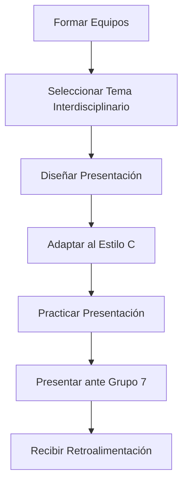

# Presentar una Propuesta Interdisciplinaria de Proyectos (Clase 2 — Actividad 1)

**Curso:** Habilidades de Presentación y Persuasión (ISIL, 2026-2)  
**Docente:** [pendiente]  
**Fecha:** [pendiente]

---

## 1. Descripción del Problema

En el ámbito profesional, presentar proyectos interdisciplinarios requiere comunicar ideas complejas a audiencias con distintos estilos de comportamiento. Un error común es usar el mismo enfoque para todos, lo que reduce la efectividad de la presentación.

En esta actividad, los estudiantes deberán diseñar y presentar una propuesta de proyecto interdisciplinario adaptada a un público con estilo **Controlador (C)** según el modelo DISC.

---

## 2. Solución Propuesta

### 2.1 Instrucciones

1. **Formar equipos de 3-4 personas** (Grupo 7).
2. **Elegir un proyecto interdisciplinario** que combine al menos 2 áreas del conocimiento (ej: ingeniería + marketing, TI + salud, datos + finanzas).
3. **Diseñar una presentación de 10-15 minutos** que incluya:
   - Problema o necesidad que resuelve el proyecto
   - Solución propuesta con enfoque técnico
   - Beneficios concretos y medibles
   - Plan de implementación con plazos
   - Análisis de riesgos y mitigación
   - Presupuesto estimado
4. **Adaptar el estilo de comunicación** al perfil Controlador (C).

### 2.2 Criterios de Adaptación al Estilo Controlador

Basado en la clase 2, la presentación debe incluir:

| Elemento | Cómo adaptar al estilo C |
|----------|--------------------------|
| **Datos objetivos** | Incluir cifras, porcentajes y métricas verificables |
| **Estructura clara** | Seguir un formato lógico: problema → solución → implementación |
| **Documentación** | Entregar un documento de soporte con análisis detallado |
| **Puntualidad** | Cumplir estrictamente con el tiempo asignado |
| **Tono formal** | Evitar humor excesivo o lenguaje informal |
| **Anticipación** | Preparar respuestas a preguntas técnicas y de detalle |

### 2.3 Lo que DEBES incluir

- **Gráficos comparativos** que muestren alternativas y justifiquen la elección
- **Tablas de costos** con desglose detallado
- **Cronograma** con hitos medibles
- **Análisis de riesgos** con estrategias de mitigación
- **Referencias** a fuentes confiables (estudios, casos de éxito)

### 2.4 Lo que DEBES evitar

- Generalizaciones sin respaldo de datos
- Decisiones presentadas sin alternativas de comparación
- Datos inexactos o aproximaciones sin fundamento
- Tono demasiado casual o emocional
- Omitir detalles cuando te pregunten "¿cómo funciona exactamente?"

---

## 3. Diagrama o Esquema

### Flujo de la Actividad

### Checklist de Preparación

- [ ] El tema combina al menos 2 áreas del conocimiento
- [ ] Se incluyen datos objetivos y métricas
- [ ] La estructura sigue un formato lógico y secuencial
- [ ] Se preparó documentación de soporte
- [ ] El tiempo de presentación es de 10-15 minutos
- [ ] Se anticiparon preguntas técnicas del público
- [ ] El tono es formal y profesional

---

## 4. Justificación

Esta actividad permite a los estudiantes aplicar de forma práctica los conceptos de la clase 2 sobre los estilos de comportamiento DISC. Al presentar ante un público Controlador, los estudiantes experimentan en primera persona cómo adaptar su comunicación a un estilo que valora:

- **Precisión:** Datos exactos, no aproximaciones
- **Lógica:** Argumentos estructurados y coherentes
- **Evidencia:** Documentación que respalde cada afirmación
- **Eficiencia:** Respeto por el tiempo y las prioridades

El Controlador es uno de los estilos más exigentes en cuanto a contenido técnico, por lo que prepararse para esta audiencia fortalece la capacidad de cualquier profesional para comunicar proyectos complejos con rigor y claridad.

---

## 5. Conclusiones

1. **Adaptar la comunicación al estilo de la audiencia** es fundamental para el éxito de una presentación.
2. **El estilo Controlador (C)** exige datos objetivos, estructura lógica y documentación de soporte.
3. **Los proyectos interdisciplinarios** requieren habilidad para integrar conocimientos de distintas áreas y comunicarlos de forma coherente.
4. **Prepararse para audiencias exigentes** fortalece la capacidad de comunicación profesional en cualquier contexto.

**Frase clave:**
> "Un Controlador no se convence con emociones, se convence con evidencia."

---

## 6. Fuentes

| # | Fuente | Tipo | URL |
|---|--------|------|-----|
| 1 | Perfildisc.com - Estilos de personalidad DISC | Sitio web | http://www.perfildisc.com/acerca-de-disc/estilos-de-personalidad-disc |
| 2 | Marston, William M. *Emotions of Normal People* (1928) | Libro | https://www.amazon.com/Emotions-Normal-People-William-Marston/dp/1614273769 |
| 3 | Hedge, Jason. *The Essential DISC Training Workbook* (2012) | Libro | https://www.amazon.com/Essential-DISC-Training-Workbook/dp/1592602312 |

---

*Última actualización: 08/09/2026.*
