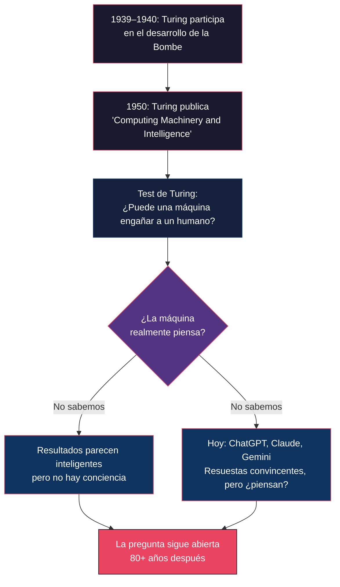
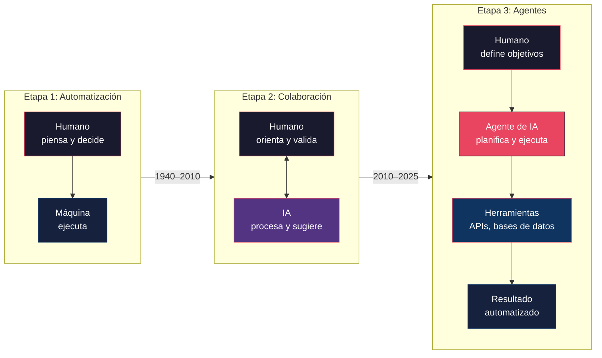

# Código Enigma e Inteligencia Artificial — Clase 1 (Actividad 1)

**Curso:** Inteligencia Artificial Aplicada (ISIL, 2026-2)
**Estudiante:** Carlos Gil Carrillo
**Equipo:** Luis Eduardo Alba Garcia, Carlos Enrique Gil Carrillo, Alexis Paolo Cordova Tavara, Jose Guillermo Jhianpol Roman Sante, Milena Xiomara Suarez Coronado y Cristina Zevallos Rojas 
**Docente:** Mg. Christian Cancharez Aguirre
**Fecha:** 03/09/2026
**Infografía HTML:** [Ver infografía](https://htmlpreview.github.io/?https://github.com/i-xarlos/isil-ing-sistemas/blob/main/2026-2/Inteligencia-Artificial-Aplicada/clase-1/actividad-1/codigo-enigma-inteligencia-artificial-actividad-1.html)

---

La película *Código Enigma* (2014) no es solo una historia de guerra. Es, casi sin proponerlo, una de las mejores metáforas sobre qué es la inteligencia artificial y de dónde viene. Si la viste, quizá notaste que Turing no construía simplemente una máquina rápida. Estaba haciendo algo más profundo: intentaba convertir un problema que parecía requerir genialidad humana en un proceso que una máquina pudiera ejecutar.

Eso, en esencia, es el objetivo de la IA desde sus inicios.

## El problema de Enigma

Un equipo de personas tardaría **siglos** en probar manualmente cada configuración posible de Enigma. La **Bombe** podía hacer ese trabajo en **horas**. Sin esa velocidad, la guerra se habría extendido y millones de vidas habrían estado en riesgo.

Había aproximadamente **158.962.555.217.826.360.000** combinaciones posibles (se lee: **ciento cincuenta y ocho trillones**, novecientos sesenta y dos mil quinientos cincuenta y cinco billones, doscientos diecisiete mil millones, ochocientos veintiséis millones, trescientos sesenta mil). Probarlas una por una era como buscar una aguja en un gigantesco pajar.

### La idea de Turing

En lugar de probar cada configuración a mano, Turing propuso automatizar la búsqueda. Su idea fue crear una máquina que pudiera:

- Probar rápidamente muchas configuraciones.
- Descartar las que no funcionaban.
- Encontrar patrones en los mensajes cifrados.

> **Idea clave:** La clave no era pensar como un humano, sino hacer muchas pruebas de forma rápida y sistemática.

---

## De la máquina de Turing a las computadoras modernas

Para entender por qué la película conecta tanto con la IA, primero hay que entender qué era la "máquina de Turing" y cómo nos llevó hasta aquí.

En 1936, Alan Turing publicó un artículo donde describió un modelo teórico de computación: una máquina que podía leer instrucciones en una cinta y ejecutar operaciones lógicas simples. No existía físicamente, pero demostró algo poderoso: **cualquier problema que pueda resolverse con lógica puede ser procesado por una máquina, siempre que tenga las instrucciones correctas**.

Esa idea sentó las bases de lo que hoy llamamos computación. Sin ella, no existirían las computadoras, ni el internet, ni los teléfonos inteligentes, ni la inteligencia artificial.

| Hito                                     | Año       | ¿Por qué importa?                                                                                                                                                |
| ---------------------------------------- | ---------- | ------------------------------------------------------------------------------------------------------------------------------------------------------------------ |
| **Máquina de Turing**             | 1936       | Modelo matemático abstracto que definió qué significa que un problema sea computable. No era un aparato físico ni descifraba mensajes.                         |
| **Bombe ("Christopher")**          | 1939–1940 | Máquina electromecánica basada en un diseño polaco previo, mejorada por Turing y Gordon Welchman para descifrar Enigma.                                         |
| **Colossus**                       | 1943–1944 | Primera computadora electrónica programable. Descifraba Lorenz, no Enigma, y fue diseñada principalmente por Tommy Flowers con aportes del equipo de Max Newman. |
| **ENIAC**                          | 1945       | Primera computadora electrónica de propósito general; podía programarse para resolver diferentes tipos de problemas.                                            |
| **Test de Turing**                 | 1950       | Turing planteó formalmente la pregunta: «¿Puede una máquina pensar?». Esto impulsó el campo de la IA.                                                        |
| **Conferencia de Dartmouth**       | 1956       | Se acuñó el término «Inteligencia Artificial» y comenzaron los primeros sistemas del campo.                                                                   |
| **Algoritmos modernos**            | 1980s      | Las computadoras empezaron a organizar y optimizar información a mayor escala.                                                                                    |
| **Inteligencia Artificial actual** | Hoy        | Los sistemas aprenden, analizan y generan respuestas con décadas de evolución tecnológica.                                                                      |

La Bombe funcionaba probando combinaciones de rotores hasta encontrar la configuración diaria de Enigma. El nombre «Christopher» es una licencia dramática de la película: en la vida real, la Bombe no se llamaba así.

Colossus era una máquina completamente distinta. Se construyó años después para descifrar el cifrado Lorenz. El rol de Turing fue indirecto y no fue su diseñador principal.

ENIAC utilizaba 17.468 tubos de vacío, 7.200 diodos y 1.500 relés. Su importancia estuvo en que podía programarse para resolver problemas diferentes.

Lo fascinante es que Turing no solo imaginó la computadora: también imaginó que esas máquinas podrían hacer cosas que antes solo podíamos hacer nosotros con la mente. La película *Código Enigma* muestra exactamente ese momento: cuando una máquina empieza a hacer un trabajo que parecía exclusivamente humano.

En resumen: la Máquina de Turing es la idea madre, la Bombe ("Christopher" en la película) es la aplicación práctica de esa idea durante la guerra, y Colossus es el siguiente salto tecnológico, ya acercándose a lo que hoy entendemos como computadora.

La evolución no fue un salto, sino una misma idea que se fue perfeccionando con el tiempo: **¿podemos usar una máquina para realizar automáticamente una tarea que sería demasiado difícil o lenta para un ser humano?**

> *Una idea puede cambiar el futuro.*

---

## Paralelos entre *Código Enigma* y la IA

Lo que hace la película tan relevante es que casi cada escena tiene un equivalente directo en cómo funciona la IA hoy:

| En la película                                                                                                                           | En la IA moderna                                                                                                |
| ----------------------------------------------------------------------------------------------------------------------------------------- | --------------------------------------------------------------------------------------------------------------- |
| Turing construye una máquina para resolver un problema que los humanos no pueden procesar manualmente, con la rapidez que se necesitaba. | Las IA procesan cantidades enormes de información que serían imposibles de analizar manualmente.              |
| La máquina prueba sistemáticamente diferentes configuraciones de Enigma.                                                                | Los algoritmos exploran enormes espacios de posibilidades para encontrar patrones o soluciones.                 |
| Turing intenta convertir un problema intelectual en un proceso mecánico.                                                                 | La IA busca convertir tareas que asociamos con la inteligencia humana en procesos computacionales.              |
| La máquina necesita que los humanos definan el problema y las reglas.                                                                    | Los modelos actuales dependen de objetivos, datos, instrucciones y sistemas diseñados por humanos.             |
| El equipo interpreta los resultados de la máquina.                                                                                       | Hoy los humanos siguen siendo necesarios para interpretar, validar y utilizar las respuestas de una IA.         |
| La máquina encuentra posibles soluciones, pero no decide por sí misma qué hacer con ellas.                                             | Una IA puede generar predicciones o recomendaciones, pero la decisión y responsabilidad siguen siendo humanas. |
| Turing imagina una máquina capaz de realizar una tarea que parece requerir inteligencia.                                                 | La IA moderna intenta realizar tareas como razonar, escribir, programar, reconocer imágenes o conversar.       |
| El trabajo de Turing cambia la forma de entender lo que una máquina puede hacer.                                                         | La IA está cambiando nuestra concepción de qué tareas requieren necesariamente inteligencia humana.          |

**¿Por qué importa esta tabla?** Porque nos obliga a pensar en la IA no como algo mágico o nuevo, sino como la continuación de una idea que empezó hace más de 80 años: construir máquinas que hagan cosas que antes solo podíamos hacer nosotros.

La clave del éxito no era que la máquina «pensara» como una persona, sino que realizara millones de operaciones de forma rápida, ordenada y sin errores. La automatización fue la gran ventaja.

### Cuatro formas en que Enigma conecta con la IA actual

1. **Automatización:** Turing buscaba que una máquina realizara automáticamente tareas que requerían intervención humana. Hoy la IA analiza datos, traduce idiomas, reconoce imágenes y responde preguntas.
2. **Algoritmos:** La Bombe siguió procedimientos sistemáticos para analizar configuraciones. Los algoritmos siguen siendo fundamentales en la informática y la IA.
3. **Grandes volúmenes de información:** El problema de Enigma implicaba una cantidad enorme de posibilidades. La solución consistió en analizarlas mucho más rápido que una persona.
4. **La pregunta sobre el pensamiento:** Turing planteó si una máquina puede pensar y creó el concepto del «juego de imitación», hoy relacionado con chatbots y asistentes de IA.

> **Del código al algoritmo, del algoritmo a la IA.**

---

## El paralelo más profundo: "¿Puede una máquina pensar?"

Este es probablemente el vínculo más importante entre la película y la IA actual.



En la película, Turing no se centra únicamente en construir una máquina rápida. Su idea fundamental es:

> **¿Podemos construir una máquina que realice una tarea que normalmente consideramos propia de la inteligencia humana?**

Después de la guerra, Turing llevó esta pregunta mucho más lejos con su famoso trabajo de 1950 sobre máquinas inteligentes y el llamado **Test de Turing**. La idea era simple pero radical: si una máquina puede conversar y engañar a un humano para que crea que es otro humano, entonces se puede decir que "piensa".

Hoy hacemos prácticamente la misma pregunta con sistemas como ChatGPT, Claude, Gemini y otros:

> **¿Una máquina está realmente pensando o simplemente está produciendo resultados que parecen inteligentes?**

Y aquí aparece un paralelo fascinante. Cuando usas ChatGPT y te responde algo convincente, estás viviendo la misma experiencia que los personajes de la película cuando ven la máquina de Turing funcionando por primera vez: la sensación de que algo "parece" inteligente, aunque no sabemos exactamente si lo es.

> **Idea clave:** La pregunta de Turing no se resolvió en 1950. Sigue abierta. Cada vez que usas una IA, estás contribuyendo a responderla.

---

## De Turing a las IA actuales

La máquina de Turing de la película no "piensa" como una persona.

Hace algo diferente:

```text
Problema → reglas → procesamiento masivo → resultado
```

- **Problema:** un objetivo claro definido por humanos.
- **Reglas:** instrucciones fijas para procesar.
- **Procesamiento masivo:** miles de combinaciones por segundo.
- **Resultado:** la solución encontrada.

En un momento de la película se ve cómo la máquina prueba combinaciones una tras otra, descartando las que no funcionan hasta encontrar una que rompe el cifrado de Enigma. No hay "insight" ni creatividad. Hay proceso.

Las IA modernas siguen una idea conceptualmente relacionada:

```text
Entrada → modelo → procesamiento → respuesta
```

- **Entrada:** prompt o dato del usuario.
- **Modelo:** redes neuronales entrenadas con datos.
- **Procesamiento:** patrones aprendidos, no reglas fijas.
- **Respuesta:** texto, imagen o acción generada.

La diferencia es que los sistemas modernos son muchísimo más sofisticados. Una IA como un modelo de lenguaje no está simplemente probando todas las respuestas posibles. Ha aprendido patrones a partir de enormes cantidades de datos y utiliza esos patrones para generar una respuesta.

**Un ejemplo concreto:** Piensa en cómo aprendes a cocinar. Al principio sigues recetas al pie de la letra (eso sería como una máquina que prueba combinaciones). Con el tiempo, empiezas a "sentir" qué combina con qué, cuánta sal es suficiente, qué textura debe tener la masa. Los modelos de IA hacen algo parecido: aprendieron patrones de millones de ejemplos y ahora pueden "generar" respuestas nuevas basándose en esos patrones.

---

## Turing como precursor de la IA

Hay algo especialmente interesante para quienes trabajan en software:

Turing estaba intentando **separar el concepto de inteligencia del mecanismo biológico que utilizamos los humanos**.

Un humano puede descifrar un código utilizando razonamiento, intuición, experiencia.

Turing preguntó, esencialmente:

> *¿Y si conseguimos construir un mecanismo que haga ese proceso de manera automática?*

Eso es muy parecido al objetivo histórico de la IA:

> **Automatizar capacidades que tradicionalmente asociamos con la inteligencia humana.**

**Ejemplo en la vida real:** Cuando usas GPS para llegar a un lugar que no conoces, estás delegando la capacidad de "saber dónde estás y hacia dónde ir" en una máquina. Hace 30 años, esa era una habilidad puramente humana (o al menos necesitabas un mapa y buena orientación). Hoy la automatizamos.

---

## Procesar información ≠ inteligencia

La película también muestra algo que sigue siendo muy relevante hoy: una máquina que procesa información no es automáticamente inteligente.

**Tener una máquina capaz de procesar información no significa automáticamente tener inteligencia.**

La máquina de Turing necesita:

1. Un problema definido por humanos.
2. Un método diseñado por humanos.
3. Información proporcionada por humanos.
4. Personas que interpreten los resultados.
5. Personas que decidan qué hacer con esos resultados.

Y esto sigue siendo parcialmente cierto con la IA actual. Un modelo de lenguaje como ChatGPT no "decide" qué responder por iniciativa propia. Responde porque alguien le hizo una pregunta y le dio instrucciones sobre cómo comportarse.

**Diferencia clave:** La máquina de Enigma ejecutaba un algoritmo fijo. Los modelos de IA modernos pueden adaptar sus respuestas según el contexto. Pero ninguno de los dos "sabe" lo que está haciendo en el sentido en que tú lo sabes.

Por eso existe una discusión tan importante alrededor de los **agentes de IA**: estamos pasando de sistemas que simplemente responden a sistemas que pueden **planificar, utilizar herramientas y ejecutar acciones**. Es como pasar de una calculadora a un asistente que puede buscar información, tomar decisiones y actuar en tu nombre.

---

## El paralelo más interesante

La película muestra el comienzo de una transición. Pero no se detuvo ahí. La relación entre humanos y máquinas ha evolucionado en tres etapas claras:



| Etapa                                     | Rol del humano                       | Rol de la máquina                            |
| ----------------------------------------- | ------------------------------------ | --------------------------------------------- |
| **1. Automatización (1940–2010)** | Piensa, decide, ejecuta parcialmente | Ejecuta tareas repetitivas                    |
| **2. Colaboración (2010–2025)**   | Orienta, pregunta, valida resultados | Procesa datos, sugiere opciones               |
| **3. Agentes (2025+)**              | Define objetivos y criterios         | Planifica, usa herramientas, ejecuta acciones |

En ese sentido, *Código Enigma* puede verse casi como una **historia sobre el nacimiento de una idea que décadas después desembocaría en la inteligencia artificial moderna**.

Turing es una figura especialmente importante porque estuvo involucrado en **los fundamentos matemáticos de la computación, las primeras máquinas programables y las primeras preguntas formales sobre inteligencia artificial**.

**Dato histórico:** Alan Turing publicó su artículo "Computing Machinery and Intelligence" en 1950, solo cinco años después de que terminara la guerra. En ese artículo planteó la pregunta que todavía hoy define el campo de la IA. Es impresionante pensar que alguien que trabajó descifrando códigos nazis también sentó las bases teóricas para todo lo que hoy llamamos inteligencia artificial.

---

## Conclusiones

1. **La IA no nació con ChatGPT.** La idea de construir máquinas que ejecuten tareas inteligentes tiene sus raíces en los años 40, con Alan Turing y la máquina que descifró Enigma. La tecnología cambió, pero el objetivo central se mantiene.
2. **Procesar no es pensar.** La máquina de Turing ejecutaba un algoritmo sin entender nada. Los modelos modernos son más sofisticados, pero siguen dependiendo de humanos.
3. **El verdadero salto es de herramienta a colaborador.** Pasamos de máquinas que solo ejecutan instrucciones a sistemas que pueden adaptarse, generar contenido y tomar decisiones parciales. Eso cambia la forma en que trabajamos y aprendemos.
4. **La pregunta sigue abierta.** ¿Qué parte de nuestra inteligencia puede ser replicada por una máquina? La película fue la primera respuesta práctica; la IA actual es la continuación.

### Una precisión histórica

> **No era como ChatGPT:** La Bombe funcionaba mediante búsqueda y comprobación de configuraciones. No aprendía como los sistemas actuales de *machine learning*, pero representa un antecedente histórico muy importante de la computación.
> **Takeaway:** La conexión entre *Código Enigma* y la IA no es solo histórica. Es conceptual: ambos buscan automatizar lo que antes solo podíamos hacer con la mente humana.
>
> *Lo que comenzó como una máquina para resolver códigos terminó ayudando a plantearse una de las preguntas más importantes de nuestra era: **¿hasta dónde puede llegar la inteligencia de una máquina?***

---

## Preguntas de reflexión

Para cerrar esta actividad, reflexiona sobre estas preguntas:

1. Si la máquina de Turing "probaba combinaciones hasta encontrar la correcta", ¿qué diferencia hay con cómo un modelo de lenguaje genera una respuesta? ¿O son más parecidos de lo que creemos?
2. Turing decía que si una máquina podía engañar a un humano haciéndose pasar por otro humano, se podía considerar inteligente. ¿Estás de acuerdo con ese criterio?
3. Piensa en una tarea que hoy automatizas con tecnología (GPS, calculadora, asistente de voz). ¿Eso la convierte en "inteligente" o simplemente es una herramienta que ejecuta instrucciones?
4. La película muestra a Turing luchando contra la burocracia y el escepticismo. ¿Crees que hoy la IA enfrenta resistencias similares? ¿Cuáles?

---

## Fuentes

Las afirmaciones históricas y conceptuales se contrastan con fuentes académicas y oficiales. La película se utiliza como obra audiovisual de referencia para el análisis.

| # | Fuente                                                                                                | Tipo             | URL                                                                          |
| - | ----------------------------------------------------------------------------------------------------- | ---------------- | ---------------------------------------------------------------------------- |
| 1 | Turing, A. M. (1936).*On Computable Numbers, with an Application to the Entscheidungsproblem*       | Académica       | [Enlace](https://www.cs.virginia.edu/~robins/Turing_Paper_1936.pdf)           |
| 2 | Turing, A. M. (1950).*Computing Machinery and Intelligence*. Mind                                   | Académica       | [Enlace](https://academic.oup.com/mind/article/LIX/236/433/986238)            |
| 3 | Bletchley Park.*The Bombe*                                                                          | Oficial          | [Enlace](https://www.bletchleypark.org.uk/our-story/6-facts-about-the-bombe/)                |
| 4 | Dartmouth College.*A Proposal for the Dartmouth Summer Research Project on Artificial Intelligence* | Académica       | [Enlace](http://www-formal.stanford.edu/jmc/history/dartmouth/dartmouth.html) |
| 5 | Tyldum, M. (Director). (2014).*The Imitation Game* [Película]                                      | Obra audiovisual | [Enlace](https://www.youtube.com/watch?v=YJyXImtLhmo)                               |

*Actividad basada en la película Código Enigma (The Imitation Game, 2014), dirigida por Morten Tyldum.*

---

*Última verificación: 09/09/2026.*
