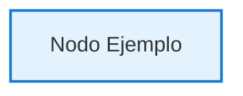
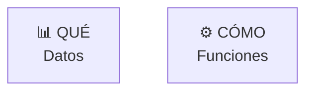
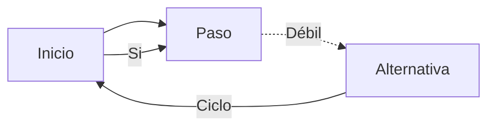

# Estándar de Iconos para Diagramas Mermaid — ISIL 2026-1

**Objetivo:** Mantener consistencia visual y significado semántico en todos los diagramas Mermaid del repositorio.

---

## 📌 Principios Generales

1. **Cada icono debe ser semántico** — Debe representar claramente el concepto del nodo
2. **Consistencia cromática** — Usar la paleta de colores definida por tipo de concepto
3. **Claridad sobre estética** — Priorizar legibilidad (tamaño de nodo, contraste)
4. **Escalabilidad** — Los iconos funcionan bien en diferentes tamaños

---

## 🎨 Paleta de Colores Estándar

| Tipo de Concepto | Color de Fondo | Color de Borde | RGB del Borde |
|---|---|---|---|
| **Inicio/Entrada** | `#E3F2FD` | Azul | `#1976D2` |
| **Estrategia/Definición** | `#F3E5F5` | Púrpura | `#7B1FA2` |
| **Ideación/Creatividad** | `#FFF3E0` | Naranja | `#F57C00` |
| **Ejecución/Implementación** | `#E8F5E9` | Verde claro | `#388E3C` |
| **Validación/Finalización** | `#C8E6C9` | Verde oscuro | `#2E7D32` |
| **Alternativa/Revisión** | `#FFE0B2` | Naranja oscuro | `#E65100` |
| **Decisión/Bifurcación** | `#F8BBD0` | Rosado | `#C2185B` |
| **Acción secundaria** | `#FFE082` | Amarillo | `#F57F17` |

**Sintaxis de aplicación:** (dentro de un diagrama completo)


---

## 📚 Bibliotecas de Iconos por Dominio

### 1️⃣ CICLOS DE PRODUCTO Y DATOS

| Fase | Icono | Nombre | Color Base |
|---|---|---|---|
| Investigación/Empatía | 👁️ | `EMPATÍA` | Azul |
| Definición/Síntesis | 📋 | `DEFINICIÓN` | Púrpura |
| Ideación/Creatividad | 💡 | `IDEACIÓN` | Naranja |
| Diseño/Prototipado | 🎨 | `PROTOTIPADO` | Verde claro |
| Validación/Testeo | ✅ | `VALIDACIÓN` | Verde |
| Feedback/Iteración | 🔄 | `FEEDBACK` | Gris/Línea punteada |

**Ejemplo:**
```mermaid
A["👁️ EMPATÍA<br/>Investigación"] --> B["📋 DEFINICIÓN<br/>Síntesis"]
B --> C["💡 IDEACIÓN<br/>Creatividad"]
C --> D["🎨 PROTOTIPADO<br/>Construcción"]
D --> E["✅ VALIDACIÓN<br/>Testeo"]
E --> |"🔄 Feedback"| A
```

---

### 2️⃣ ARQUITECTURA Y FRAMEWORKS

| Concepto | Icono | Significado |
|---|---|---|
| Datos | 📊 | Información, bases de datos |
| Función/Proceso | ⚙️ | Operaciones, flujos |
| Red/Infraestructura | 🌐 | Conectividad, topología |
| Gente/Recursos | 👥 | Roles, stakeholders |
| Tiempo/Cronograma | ⏰ | Duración, timeline |
| Motivo/Objetivo | 🎯 | Propósito, metas |

**Ejemplo Zachman:**


---

### 3️⃣ METODOLOGÍAS ÁGILES (SCRUM, KANBAN)

| Evento/Artefacto | Icono | Descripción |
|---|---|---|
| Backlog | 📝 | Lista de requisitos |
| Planificación | 📋 | Sprint Planning |
| Sprint/Trabajo | 👥 | Equipo en acción |
| Sincronización | 🔄 | Daily Standup |
| Revisión | 🔍 | Sprint Review |
| Retrospectiva | 💬 | Reflexión colectiva |
| Entrega | ✅ | Incremento completado |
| Valor | 🎁 | Resultado entregable |

**Ejemplo Scrum:**
```mermaid
PB[("📝 PRODUCT<br/>BACKLOG")] --> SP["📋 SPRINT<br/>PLANNING"]
SP --> SB["🎯 SPRINT<br/>BACKLOG"]
SB --> DS{"🔄 DAILY<br/>SCRUM"}
DS --> DEV["👥 DESARROLLO<br/>Sprint"]
DEV --> SR["🔍 SPRINT<br/>REVIEW"]
SR --> INC["✅ INCREMENTO"]
```

---

### 4️⃣ CUSTOMER JOURNEY Y EXPERIENCIA

| Etapa | Icono | Emoción | Color |
|---|---|---|---|
| Awareness | 👀 | Curiosidad ⭐ | Amarillo |
| Consideración | 🤔 | Duda ❓ | Naranja claro |
| Decisión | ✔️ | Seguridad 🛡️ | Naranja medio |
| Compra | 💳 | Confianza ✨ | Naranja oscuro |
| Post-Venta | 😊 | Satisfacción 💚 | Verde |

**Ejemplo Journey Map:**
```mermaid
A["👀 AWARENESS<br/>Conciencia"] --> B["🤔 CONSIDERACIÓN<br/>Dudas"]
B --> C["✔️ DECISIÓN<br/>Seguridad"]
C --> D["💳 COMPRA<br/>Confianza"]
D --> E["😊 POST-VENTA<br/>Satisfacción"]
```

---

### 5️⃣ ML/IA Y CIENCIA DE DATOS

| Fase | Icono | Significado | Color |
|---|---|---|---|
| Selección de Modelo | 🎯 | Decisión inicial | Azul |
| Entrenamiento | 🏋️ | Aprendizaje | Púrpura |
| Tuning/Afinamiento | ⚙️ | Ajuste fino | Rosa |
| Optimización | 📈 | Mejora de métricas | Naranja |
| Validación | ✅ | Prueba final | Verde |
| Deployment | 🚀 | Puesta en producción | Verde oscuro |

**Ejemplo IA Lifecycle:**
```mermaid
A["🎯 SELECCIÓN<br/>Tipo de Modelo"] --> B["🏋️ ENTRENAMIENTO<br/>Con Datos"]
B --> C["⚙️ TUNING<br/>Afinamiento"]
C --> D["📈 OPTIMIZACIÓN<br/>Hiperparámetros"]
D --> E{"\u2705 Validación"}
E --> |"Sí"| F["🚀 DEPLOYAR<br/>Modelo Listo"]
```

---

## 🎨 Estilos de Líneas y Conectores

| Tipo de Conexión | Sintaxis | Significado |
|---|---|---|
| Flujo normal | `-->` | Progresión secuencial |
| Flujo condicional | `-\|"Condición"\|` | Decisión con etiqueta |
| Feedback/Iteración | `-- "etiqueta" -->` | Ciclo de mejora |
| Relación débil | `-.->` | Conexión secundaria |
| Paralelo | `--- ` | Acciones simultáneas |

**Ejemplos:**


---

## ✅ Checklist para Nuevos Diagramas

Antes de crear un nuevo diagrama Mermaid, verifica:

- [ ] ¿Cada nodo tiene un icono significativo?
- [ ] ¿Los colores siguen la paleta estándar del dominio?
- [ ] ¿Las líneas indican correctamente el tipo de relación?
- [ ] ¿Los textos son claros y concisos (máx. 2 líneas)?
- [ ] ¿El diagrama es legible en diferentes tamaños?
- [ ] ¿Se mantiene consistencia con otros diagramas del mismo dominio?

---

## 📂 Ubicación de Diagramas Implementados

| Curso | Archivo | Diagrama | Fecha |
|---|---|---|---|
| Dirección Estratégica de Datos | `clase-5/desarrollo-productos-servicios-datos-clase-5.md` | 5 Fases de Producto | 09/05/2026 |
| Arquitectura Empresarial | `clase-2/arquitectura-empresarial-zachman-togaf-clase-2.md` | Zachman 6x6 | 09/05/2026 |
| Customer Centricity TI | `clase-2/customer-centricity-agilidad-scrum-clase-2.md` | Ciclo Sprint Scrum | 09/05/2026 |
| Customer Centricity TI | `clase-4/customer-centricity-marcos-mapeo-clase-4.md` | Journey Map | 09/05/2026 |
| Diseño Soluciones IA | `clase-4/diseno-soluciones-ia-integracion-etica-clase-4.md` | IA Lifecycle | 09/05/2026 |

---

## 🔄 Cómo Mantener el Estándar

1. **Al crear un diagrama nuevo:** Consulta esta guía primero
2. **Al revisar un diagrama:** Verifica que siga el patrón de colores y iconos
3. **Al encontrar una excepción:** Documenta en esta guía por qué se desvía del estándar
4. **Actualización periódica:** Revisa anualmente si el estándar sigue siendo funcional

---

**Última actualización:** 09/05/2026 | **Responsable:** GitHub Copilot | **Aplica a:** ISIL 2026-1
